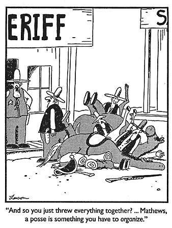
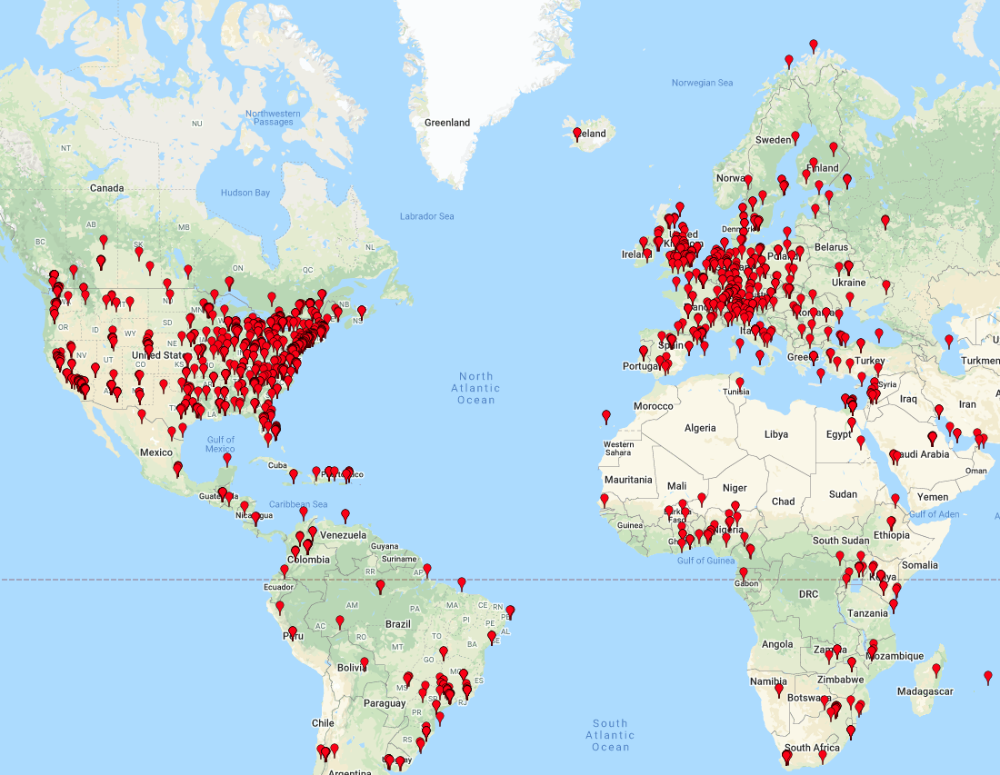

```{r setup, include=FALSE}
options(htmltools.dir.version = FALSE)
library(tidyverse)
library(here)
library(rmarkdown)
library(xaringan)
library(knitr)
```

```{r xaringan-themer, include=FALSE, warning=FALSE}
library(xaringanthemer)
style_duo_accent(
  primary_color = "#1381B0",
  secondary_color = "#FF961C",
  inverse_header_color = "#FFFFFF"
)
```

# Excel is Easy

.pull-left[
Just open it up and type in your data!


]

--

.pull-right[
But that doesn't produce<br>
good outcomes.

```{r out.width = "80%", echo=FALSE}

```


]
---

# Excel is Everywhere

.pull-left[
Designed to help small businesses.<br>
It can do: <br>

- Data Entry
- Database
- Calculations
- Data Visualization<br>

All in one!

```{r out.width = "80%", echo=FALSE}

```
]

--

.pull-right[
But it is not **great** at any of these.<br>
So it might not be the right tool for _your_ job.

```{r out.width = "90%", echo=FALSE}
knitr::include_graphics("images/tools.jpg")
```
]

---
class: inverse, center, middle

# What Kinds of Tools Do You _Actually_ Need for Medical Research Data Management?

---

# The Wish List

- Data Entry
- Hard to over-write data by mistake
- Data Validation (type, range)
- Data Security (PHI)
- Good for Collaboration (audit trail)
- Easy to Analyze
- Data Analysis is Reproducible
- Errors are Obvious & Easy to Detect

---

# The Reality

- Excel is designed for small data (small businesses) 
  and it does not scale well - it fails with big data

- Excel is filled with compromises
- It is very easy to over-write data
- You can type anything into a cell (wrong data type, typos)

- It is very easy to over-write formulas
- Formulas are hidden (good for printing, bad for checking)

- Structure encourages very wide data (left-to-right)
  - but is actually designed for very tall data <br>
  (16,384 columns, 1 million+ rows maximum)
 
- Many tools on the web to open pwd-protected Excel files
 
- Excel fails *silently*

---

# The Horror Stories

- In 2020, the UK COVID tracing program "lost" tens of thousands of COVID cases when Excel ran out of columns each day.
  - Someone eventually noticed exactly 16,384 cases **every** day.
  
--

- 88% of forensically examined business spreadsheets contain errors.
- More than 20% of gene datasets submitted with scientific datasets contain errors.

--

- Silent miscalculation in a spreadsheet in 2012 led to loss of > 2B dollars by JP Morgan - an error from manual point-and-click manipulation of spreadsheets.

--

- Excel so often "helpfully" renames human gene names as dates that in 2020, the HUGO Gene Nomenclature Committee chose to rename 27 genes because Excel was unfixable.

--

- There is a whole website and annual conference devoted to spreadsheet horror stories and associated business risks.<br>
http://www.eusprig.org/horror-stories.htm

---

# The Alternatives

- Secure Data Entry with REDCap
  - free, universal, HIPAA-compliant, backed up
  - but learning curve !
  - free learning resources
  - invest in yourself and your career

```{r out.width = "60%", echo=FALSE}

```

---
class: inverse

# The Alternatives

- Data Analysis - R
- Graphics - R
- Reporting - R

with open-source languages like R for free
  - but learning curve !
  - free learning resources
  - invest in yourself and your career

```{r out.width = "30%", echo=FALSE}

```